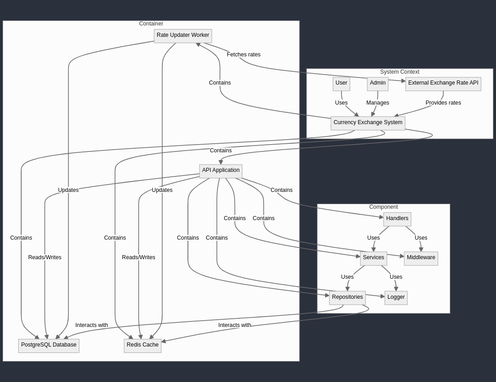
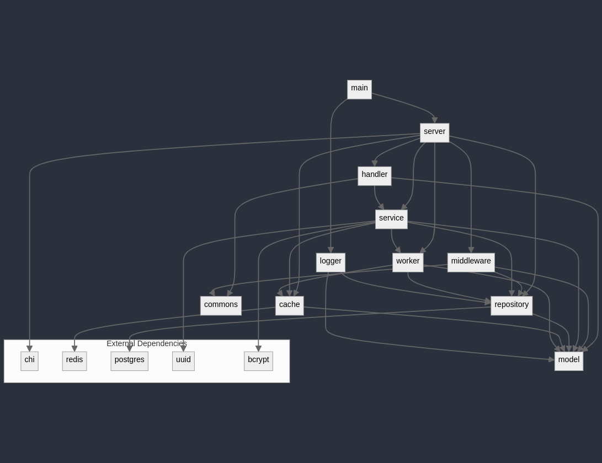
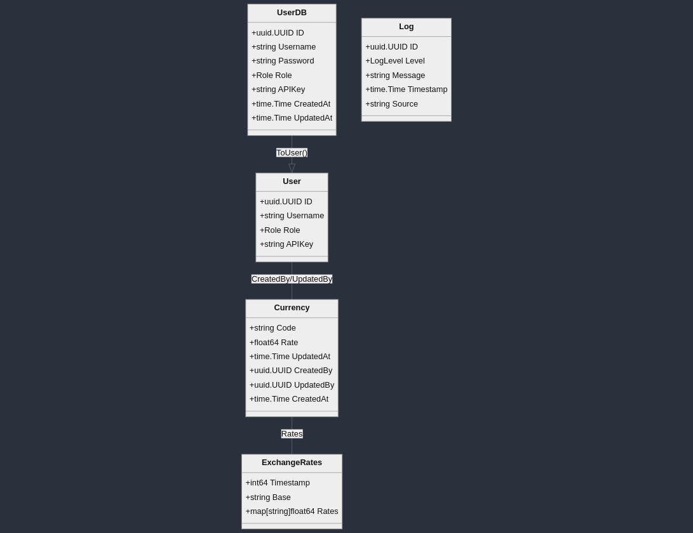

# Challenge Bravo


## Table of Contents

-   [Challenge Bravo](#challenge-bravo)
    -   [Table of Contents](#table-of-contents)
    -   [Project Description](#project-description)
    -   [Technology Stack](#technology-stack)
    -   [Services](#services)
    -   [Features](#features)
    -   [Setup and Configuration](#setup-and-configuration)
        -   [Environment Variables](#environment-variables)
        -   [Constants Configuration](#constants-configuration)
        -   [Docker Setup](#docker-setup)
        -   [Local Development](#local-development)
        -   [Testing](#testing)
        -   [Manual Testing](#manual-testing)
    -   [API Documentation](#api-documentation)
        -   [Base URL](#base-url)
        -   [Swagger Documentation](#swagger-documentation)
        -   [Authentication](#authentication)
        -   [Endpoints](#endpoints)
            -   [Currency Conversion](#currency-conversion)
                -   [GET /currency/convert](#get-currencyconvert)
            -   [Currency Management (Admin only)](#currency-management-admin-only)
                -   [POST /currency](#post-currency)
                -   [PUT /currency/{code}](#put-currencycode)
                -   [DELETE /currency/{code}](#delete-currencycode)
            -   [User Management](#user-management)
                -   [POST /auth/register](#post-authregister)
                -   [POST /auth/login](#post-authlogin)
        -   [Error Responses](#error-responses)
        -   [Rate Limiting](#rate-limiting)
        -   [C4 Diagram](#c4-diagram)
        -   [Dependencies Map](#dependencies-map)
        -   [Entity Relationship Diagram](#entity-relationship-diagram)
    -   [Auto-Generated Code](#auto-generated-code)
    -   [Improvements](#improvements)
    -   [Final Thoughts](#final-thoughts)

## Project Description

This API was developed for the Bravo challenge. The goal was to create an API that could convert between various currencies, both real and fictional, with live and custom values.# Challenge Bravo

**Additionally, it should be noted that the API's base currency is USD**.

## Technology Stack

This challenge was built using a modern, scalable technology stack:

-   **Go (Golang) 1.22**: The core programming language, chosen for its performance, concurrency support, and robust standard library.
-   **PostgreSQL**: A powerful, open-source relational database used for persistent storage of currency data, user information, and logs.
-   **Redis**: An in-memory data structure store used as a caching layer to improve performance of frequent currency rate lookups.
-   **Docker**: Used for containerization, ensuring consistent environments across development and production.
-   **Docker Compose**: A tool for defining and running multi-container Docker applications, simplifying the setup and deployment process.
-   **Chi Router**: A lightweight, idiomatic HTTP router for Go, providing a flexible and composable way to build APIs.

## Services

1. **API Application**: The main service handling HTTP requests for currency conversion, user management, and currency administration.
2. **PostgreSQL Database**: Stores user data, currency information, and logs.
3. **Redis Cache**: Caches frequently accessed exchange rates for improved performance.
4. **Migrator**: A standalone service for running database migrations to create and update the database schema, as well as
   seeding the database for a default admin user.
5. **Rate Updater**: A standalone service that fetches the latest exchange rates from an external API and updates the database and the cache
   with the new values.

## Features

-   Real-time currency conversion
-   User registration and authentication
-   Admin-only currency management (add, update, remove currencies)
-   Rate limiting to prevent abuse
-   Logging and auditing of operations
-   Scheduled updates of exchange rates
-   Caching of frequently accessed data
-   Comprehensive error handling and logging
-   Containerized deployment for easy scaling and management

## Setup and Configuration

This section outlines how to setup and configure this api, including environment variables and important constants.

One thing that is important to note is that the API uses an [external service](https://openexchangerates.org/) to get the exchange rates, so you will need
an API token to use the service. To facilitate this proccess please use this API Key: `75cc9115d3524769a498914d118e093a`

### Environment Variables

Create a `.env` file in the project root with the following variables:

-   `REDIS_PASSWORD`: Password for the Redis instance.
-   `REDIS_ADDR`: Address and port of the Redis instance (e.g., "localhost:6379").
-   `POSTGRES_USER`: Username for the PostgreSQL database.
-   `POSTGRES_PASSWORD`: Password for the PostgreSQL database.
-   `POSTGRES_HOST`: Hostname of the PostgreSQL database.
-   `POSTGRES_PORT`: Port number for the PostgreSQL database.
-   `POSTGRES_NAME`: Name of the PostgreSQL database.
-   `API_KEY`: API key for the OpenExchangeRates.
-   `SERVER_PORT`: Port on which the API server will listen.

Example `.env` file:

```
REDIS_PASSWORD=myredispassword
REDIS_ADDR=redis:6379
POSTGRES_USER=myuser
POSTGRES_PASSWORD=mypassword
POSTGRES_HOST=db
POSTGRES_PORT=5432
POSTGRES_NAME=currency_db
API_KEY=75cc9115d3524769a498914d118e093a
SERVER_PORT=8080
```

To modify and add more environment variables, please create and validate them in the `internal/commons/config.go` file.

### Constants Configuration

The `internal/commons/constants.go` file contains important constants that can be adjusted to fine-tune the API's behavior:

-   `AllowedCurrencyLength`: Maximum length of currency codes (default: 5). For this one you'll also need to change the `005_expand_currency_code.sql` migration
-   `MinimumCurrencyLength`: Minimum length of currency codes (default: 3).
-   `AllowedRPS`: Rate limit for API requests per second (default: 10).
-   `ExternalClientMaxRetries`: Maximum number of retries for external API calls (default: 3).
-   `ExternalClientBaseDelay`: Base delay for exponential backoff in external API calls (default: 1 second).
-   `ExternalClientMaxDelay`: Maximum delay for exponential backoff in external API calls (default: 30 seconds).
-   `RateUpdaterCacheExipiration`: Expiration time for cached exchange rates (default: 1 hour).
-   `RateUpdaterInterval`: Interval for updating exchange rates (default: 1 hour).
-   `ServerIdleTimeout`: Server idle timeout (default: 1 minute).
-   `ServerReadTimeout`: Server read timeout (default: 10 seconds).
-   `ServerWriteTimeout`: Server write timeout (default: 30 seconds).

To modify these constants, edit the `internal/commons/constants.go` file and rebuild the application.

### Docker Setup

To run the application using Docker, follow these steps:

1. Ensure you have Docker and Docker Compose installed on your system.

2. Clone the repository:

    ```bash
    git clone git@github.com:Lutefd/challenge-bravo.git
    cd challenge-bravo
    ```

3. Create a `.env` file in the project root and configure the necessary environment variables, a `.env.sample` file is provided (see API Configuration docs for details).

4. Build and start the Docker containers:

    ```
    docker compose up --build
    ```

5. The API will be available at `http://localhost:8080` if you're using the default port
   and host provided in the `.env.sample`.

### Local Development

For local development without Docker:

1. Ensure you have Go 1.22 or later installed.
2. Install [goose](https://github.com/pressly/goose) for database migrations.
3. Set up the environment variables as described in the API Configuration docs.
4. Run the database migrations:
    ```
    make migrate-up
    ```
5. Start the application:
    ```
    make run
    ```

### Testing

Run the test suite with:

```
make test
```

For a more verbose output:

```
go test ./... -v
```

### Manual Testing

There is a Postman collection in the `postman-collection.json` file inside of the `docs/postman` folder. You can import this collection into Postman and test the API endpoints.

## API Documentation

This section details the endpoints and operations available in this API. More information can be found in the Swagger documentation, in the c4 diagram, in the dependencies diagram, and in the entity diagram all located in the `docs` folder along with the Postman collection.

### Base URL

All endpoints are relative to: `http://localhost:8080/api/v1`

### Swagger Documentation

The API documentation is available at `http://localhost:8080/api/v1/reference`

### Authentication

Most endpoints require authentication using an API key. Include the API key in the `X-API-Key` header of your requests.

### Endpoints

#### Currency Conversion

##### GET /currency/convert

Convert an amount from one currency to another.

Query Parameters:

-   `from`: Source currency code (e.g., "USD")
-   `to`: Target currency code (e.g., "EUR")
-   `amount`: Amount to convert (numeric)

Example Request:

```
GET /api/v1/currency/convert?from=USD&to=EUR&amount=100
```

Example Response:

```json
{
    "from": "USD",
    "to": "EUR",
    "amount": 100,
    "result": 85
}
```

#### Currency Management (Admin only)

##### POST /currency

Add a new currency.

Request Body:

```json
{
    "code": "JPY",
    "rate_to_usd": 110.5
}
```

Example Response:

```json
{
    "message": "currency added successfully"
}
```

##### PUT /currency/{code}

Update an existing currency.

Request Body:

```json
{
    "rate_to_usd": 111.2
}
```

Example Response:

```json
{
    "message": "currency updated successfully"
}
```

##### DELETE /currency/{code}

Remove a currency.

Example Response:

```json
{
    "message": "currency removed successfully"
}
```

#### User Management

##### POST /auth/register

Register a new user.

Request Body:

```json
{
    "username": "newuser",
    "password": "securepassword"
}
```

Example Response:

```json
{
    "id": "123e4567-e89b-12d3-a456-426614174000",
    "username": "newuser",
    "role": "user",
    "api_key": "your-api-key-here"
}
```

##### POST /auth/login

Authenticate a user and retrieve their API key.

Request Body:

```json
{
    "username": "existinguser",
    "password": "userpassword"
}
```

Example Response:

```json
{
    "id": "123e4567-e89b-12d3-a456-426614174000",
    "username": "existinguser",
    "role": "user",
    "api_key": "your-api-key-here"
}
```

    Update(ctx context.Context, username, password string) error

### Error Responses

The API uses standard HTTP status codes to indicate the success or failure of requests. In case of an error, the response body will contain an error message:

```json
{
    "error": "Description of the error"
}
```

Common error status codes:

-   400: Bad Request (invalid input)
-   401: Unauthorized (missing or invalid API key)
-   403: Forbidden (insufficient permissions)
-   404: Not Found (resource not found)
-   429: Too Many Requests (rate limit exceeded)
-   500: Internal Server Error

### Rate Limiting

The API implements rate limiting to prevent abuse in some endpoints. If you exceed the rate limit, you'll receive a 429 status code. Wait before making additional requests.

### C4 Diagram



### Dependencies Map



### Entity Relationship Diagram



## Auto-Generated Code

-   This project used goose to execute migrations, although the migrations were written by hand, the migration code and execute is generated by [goose](https://github.com/pressly/goose).
-   It also uses mermaid to generate the diagrams in the docs folder. The mermaid code is written by hand and the diagrams are generated by the [mermaid live editor](https://mermaid.live/).
-   The swagger UI and its playground are generated by [Scalar](https://docs.scalar.com/swagger-editor), the swagger documentation is written by hand.
-   The Makefile was extracted from a [boilerplate cli tool](https://github.com/Melkeydev/go-blueprint) I've used in a lot of personal projects, but didn't use it in this project, only the makefile was copied from it.

## Improvements

There are a lot of improvements that could be made to this project, I decided to keep it as simple as possible, even removing some features that were not necessary for the base requirements of the project, but some improvements that could be made are:

-   Rate limiting using a more robust solution like Redis, this would allow for a more distributed rate limiting system. The current rate limiting is done in memory and is not distributed, using the [Rate package](https://pkg.go.dev/golang.org/x/time/rate), it uses a token bucket algorithm to limit the number of requests per second.
-   Logging, the current logging system is very simple, it registers the internal erros and info logs in a postgres database, but it could be improved to use a more robust logging system like the ELK stack. I decided to keep it simple because the requirements didn't ask for a more robust logging system and as I was already using postgres for the database, I decided to use it for the logs as well since it can handle the load, I limited it to about 1000 logs in the channel, so it won't overload the database.
-   The rate updater could be improved by making it more robust and based on the last fetched timestamp. Although it has a retry policy and a backoff policy, it could have a circuit breaker to prevent the service from being overloaded if the external service is down for a long time.
-   The currency management could be improved by adding more features like a list of all currencies, and a more detailed view of each currency, with the possibility of adding more information like the name of the currency, the symbol, and the country of origin. Also due to currencies that have a lot of decimal places, it could be improved to handle more decimal places while rounding up for the ones that don't need it, currently we're using all of the decimal places provided by the external service.
-   The user management and security could be greatly improved, right now it's really simple with users not being able to do much, not even edit their own information, it could be improved by adding more features like password recovery, email verification, and more detailed user information. The security could be improved by adding more security features like 2FA, also adding more than just an X-API-Key for authentication, like JWT tokens. But this was a decision that I made to keep it simple and to focus on the core functionality of the project, while having the minimum user management required to use the API.
-   Tests could be better and could cover more of the errors that could happen in the system, I've only covered the basic errors that could happen in the system, but there are a lot of edge cases that could be tested. Also, the tests could be more robust and could use a more robust testing framework like [Ginkgo](https://onsi.github.io/ginkgo/).

## Final Thoughts

I learned a lot while doing this challenge, there were a lot of things that could be improved and I'm going to keep studying so I can improve my skills and be able to do better in my next projects. It was a bit difficult to find the time to do this project, but I'm happy to have done it and I'm happy with the result.

<p align="center">
  
</p>
